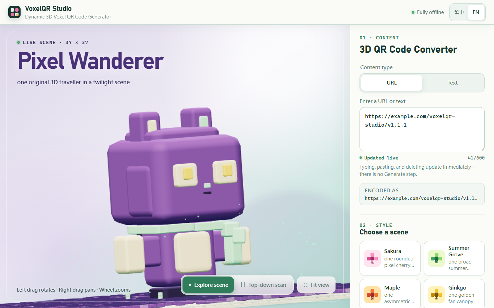
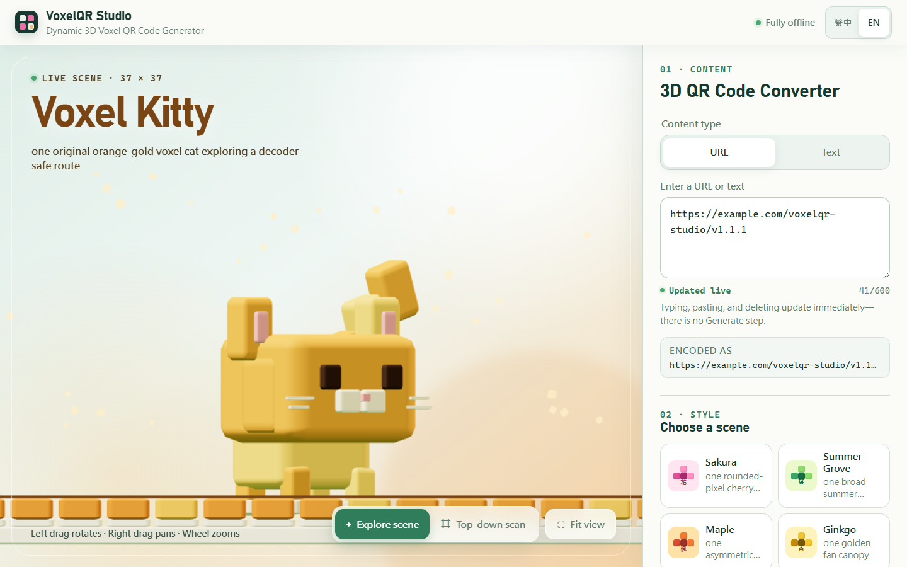
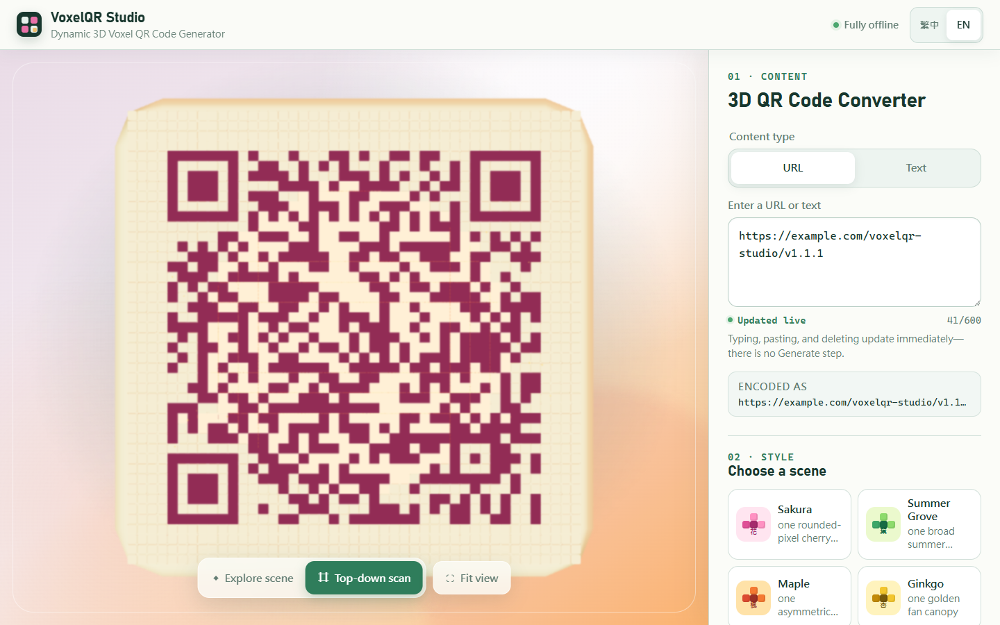
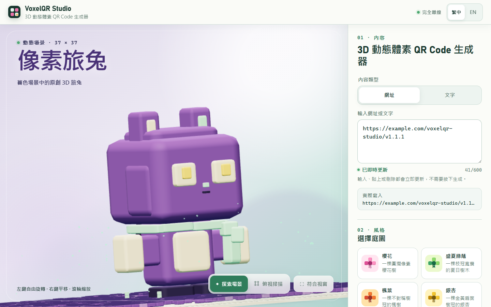
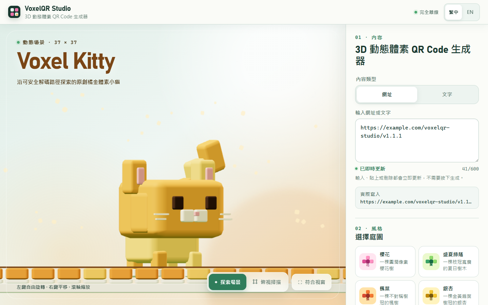
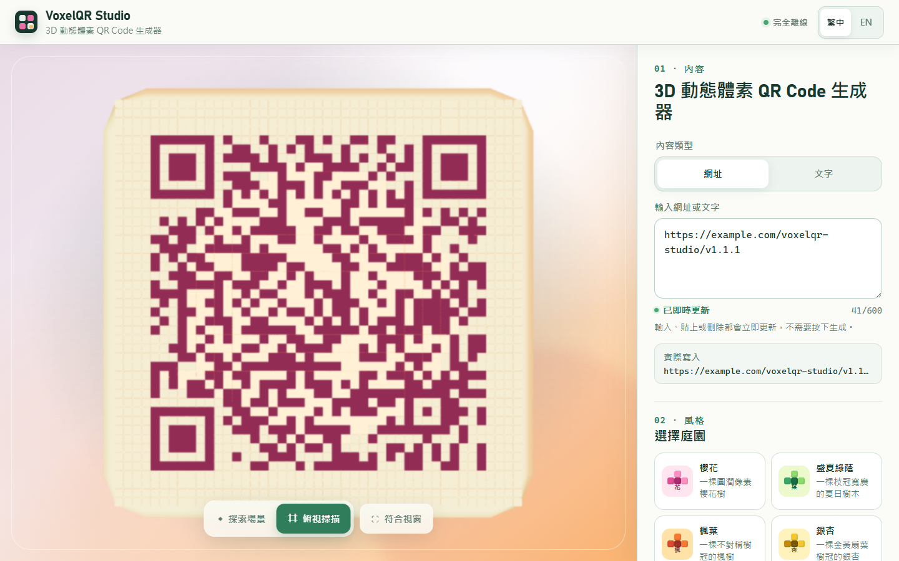

[English](#english) | [繁體中文](#traditional-chinese)

<a id="english"></a>

# VoxelQR Studio 1.1.1

VoxelQR Studio turns text or URLs into live, scannable 3D voxel QR codes. The scene updates while you type, remains interactive, and moves into a top-down Scan view without replacing the QR with another image or overlay. Version 1.1.1 runs offline as a Windows application or a single HTML file.



## What changed in 1.1.1

- Refined the public character-scale descriptions for clear, accurate product guidance.
- Completed the Traditional Chinese interface for workflow steps, all nine theme names, all nine theme descriptions, controls, hints, and status text; the English interface remains fully English.
- Added six locale-matched screenshots captured from VoxelQR Studio v1.1.1: English and Traditional Chinese versions of Pixel Wanderer, Voxel Kitty, and the top-down Scan view.

Product mechanics are unchanged from v1.1.0. Character models, motion, QR generation, Scan behavior, camera controls, export, and offline operation remain the same.

See [Release notes](RELEASE_NOTES_v1.1.1.md) for the correction scope and validation summary.

## Download and run

Download `VoxelQR-Studio-v1.1.1.zip` and extract it before use.

- Windows 11 x64: open `VoxelQR-Studio.exe`.
- Offline Web: open `VoxelQR-Studio-Web.html` in a modern Chromium-based browser.
- Neither entry point needs an account, installer, Node.js, development server, analytics service, or network connection.

## Nine animated themes

Sakura, Summer Grove, Maple, Ginkgo, Snow Pine, Sunset, Ocean Waves, Pixel Wanderer, and Voxel Kitty all use real 3D geometry. The tree themes have distinct trunk and branch structures, Ocean combines several travelling-wave scales, Pixel Wanderer is a rounded chibi rabbit, and the original orange-gold Voxel Kitty can walk, run, make short dashes, pause to observe, turn, and move its tail.

Pixel Wanderer is a compact chibi character that scales proportionally with the QR board. In the standard Explore reference view, Voxel Kitty occupies about 8% of the board and scales proportionally as the QR matrix grows.

Each production launch creates a new 128-bit cryptographic seed for Kitty. A two-layer controller combines randomly selected high-level actions with smooth turning, velocity inertia, bounded rotation, early edge avoidance, a 9×9 visitation map, and penalties for recently selected destinations. Kitty explores the complete safe physical board without a fixed waypoint order, finite route, periodic loop, or mandatory return to its starting point. The seed and motion state persist when the encoded content or QR matrix changes.

Entering Scan freezes Kitty's complete state, hides Kitty and its shadow, and moves the same scene to the top-down view. Returning to Explore restores the exact state and continues naturally from the same point.



Atmospheric particles land on the current QR board, settle for 0.5–1.5 seconds, and fade in place. They do not remain visibly below the board.



## Controls and export

- Type or paste text and URLs for immediate scene updates.
- Rotate, pan, and zoom in Explore mode.
- Use Scan to move the same scene into its QR-readable top view.
- Export the current top-down result locally.
- Switch between English and Traditional Chinese.

## Development

Requirements: Node.js 24+, npm, Windows 11 x64 for the Electron build, and a Chromium browser for runtime validation.

```powershell
npm ci
npm run dev
npm run lint
npm run typecheck
npm test
npm run build:web
npm run build:windows
npm run validate:web
npm run validate:motion
npm run validate:export
npm run validate:single
npm run validate:windows
npm run audit:licenses
npm run validate:docs
```

The complete validation sequence is documented in [Testing](docs/TESTING.md). Architecture, QR behavior, security, privacy, and design notes are available under [docs](docs/).

## Acknowledgements

VoxelQR Studio was independently implemented. Its living 3D QR presentation and interaction polish were informed at a design- and behavior-reference level by Enzo Manuel Mangano's public [Cherry Blossom post](https://x.com/reactiive_/status/2040511285998313827) and the [enzomanuelmangano/demos](https://github.com/enzomanuelmangano/demos) project. No source code, components, assets, shaders, constants, or interface from that upstream project are included in VoxelQR Studio. The upstream `demos` project uses its own custom Software License Agreement and retains `Copyright © 2024 Enzo Manuel Mangano. All rights reserved.`

## Known limitations

- Camera focus, glare, distance, and the scanner application affect real-phone QR recognition.
- WebGL 2 and hardware acceleration are recommended.
- Very long encoded content creates denser QR matrices and may need a larger on-screen presentation for reliable scanning.
- Windows builds are unsigned portable applications; Windows may display its standard reputation warning.

License: MIT. Third-party notices are in [THIRD_PARTY_NOTICES.md](THIRD_PARTY_NOTICES.md).

<a id="traditional-chinese"></a>

# VoxelQR Studio 1.1.1

中文公開名稱：**3D 動態體素 QR Code 生成器**

VoxelQR Studio 可將文字或網址即時轉換為可掃描的 3D 動態體素 QR Code。輸入時場景會立即更新並保持互動，也能在不替換 QR、不建立另一張圖片或疊加層的情況下，將同一個場景移至俯視掃描模式。v1.1.1 提供 Windows 應用程式與離線單檔 Web 版。



## 1.1.1 修正內容

- 調整公開文件中的角色尺寸說明，使產品介紹更清楚、準確。
- 補齊繁中介面的操作步驟、九個主題名稱、九段主題描述、控制項、提示與狀態文字；英文介面仍維持完整英文。
- 以 VoxelQR Studio v1.1.1 實際擷取的六張語系相符展示圖，分別提供英文與繁中的像素旅兔、Voxel Kitty 及俯視掃描畫面。

產品機制與 v1.1.0 相同；角色模型、動態、QR 產生、掃描行為、相機控制、匯出及離線操作均維持不變。

完整修正範圍與驗證摘要請見[發行說明](RELEASE_NOTES_v1.1.1.md)。

## 下載與使用

下載 `VoxelQR-Studio-v1.1.1.zip` 後，請先完整解壓縮。

- Windows 11 x64：開啟 `VoxelQR-Studio.exe`。
- 離線 Web：使用現代 Chromium 系瀏覽器開啟 `VoxelQR-Studio-Web.html`。
- 兩種入口都不需要帳號、安裝程式、Node.js、開發伺服器、分析服務或網路連線。

## 九種動態主題

櫻花、盛夏綠蔭、楓葉、銀杏、雪松、日落、海浪、像素旅兔及 Voxel Kitty 全部由真正的 3D 幾何構成。樹木主題各有不同的樹幹與分枝結構；海浪結合多種行進波尺度；像素旅兔是圓潤的可愛比例兔子；原創橘金配色小貓則會自然走動、奔跑、短衝、停下觀察、轉頭與擺尾。

像素旅兔採用小巧的可愛比例，並會隨 QR 底板同比例縮放。在標準探索參考視角下，體素小貓約佔底板的 8%，也會隨 QR 矩陣增大而同比例放大。

每次正式啟動都會為小貓建立新的 128 位元加密工作階段種子。兩層控制器會結合隨機選擇的高階動作、平滑轉向、速度慣性、有限轉動、提前避開邊界、9×9 造訪熱度圖，以及對近期目的地的降低選取權重。小貓會探索安全內縮後的完整實體底板，不使用固定路點順序、有限路線、週期循環，也不強制回到起點。變更編碼內容或 QR 矩陣時，工作階段種子與動態狀態會持續保留。

進入俯視掃描時，程式會凍結小貓的完整狀態，隱藏小貓與陰影，並把同一個場景移至俯視角度。返回探索場景後會精確還原狀態，從同一位置自然續播。



場景粒子會落到目前 QR 底板表面，停留 0.5～1.5 秒後原地淡出；可見粒子不會留在底板下方。



## 操作與匯出

- 輸入或貼上文字與網址，即時更新場景。
- 在探索模式中旋轉、平移與縮放。
- 使用俯視掃描，把同一個場景移至可讀取 QR 的俯視角度。
- 將目前俯視結果匯出至本機。
- 切換繁體中文與英文介面。

## 開發

需求：Node.js 24+、npm；建立 Electron 版需 Windows 11 x64；執行階段驗證需 Chromium 瀏覽器。

```powershell
npm ci
npm run dev
npm run lint
npm run typecheck
npm test
npm run build:web
npm run build:windows
npm run validate:web
npm run validate:motion
npm run validate:export
npm run validate:single
npm run validate:windows
npm run audit:licenses
npm run validate:docs
```

完整驗證流程請見[測試文件](docs/TESTING.md)。架構、QR 行為、安全、隱私與設計說明位於 [docs](docs/) 目錄。

## 致謝與來源關係

VoxelQR Studio 為獨立實作。產品的動態 3D QR 呈現與互動細節，曾以 Enzo Manuel Mangano 公開的 [Cherry Blossom 貼文](https://x.com/reactiive_/status/2040511285998313827) 與 [enzomanuelmangano/demos](https://github.com/enzomanuelmangano/demos) 專案作為設計及行為層級參考。本專案未包含該上游專案的原始碼、元件、素材、著色器、常數或介面。上游 `demos` 使用自訂 Software License Agreement，並保留 `Copyright © 2024 Enzo Manuel Mangano. All rights reserved.`

## 已知限制

- 手機鏡頭對焦、反光、距離及掃描應用程式都會影響實機 QR 辨識。
- 建議使用支援 WebGL 2 並啟用硬體加速的環境。
- 很長的編碼內容會產生更密集的 QR 矩陣，可能需要放大畫面才能可靠掃描。
- Windows 版是未簽章的可攜式應用程式；Windows 可能顯示標準信譽提示。

授權：MIT。第三方聲明請見 [THIRD_PARTY_NOTICES.md](THIRD_PARTY_NOTICES.md)。