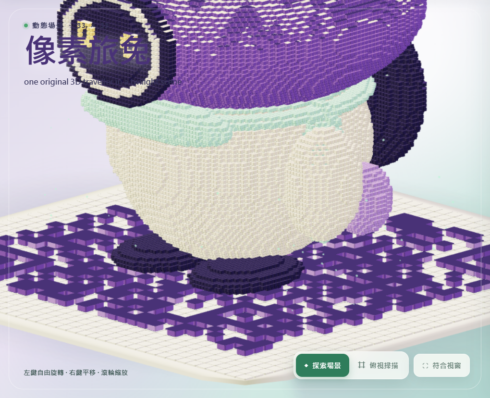

# VoxelQR Studio

中文公開名稱：**3D 動態體素 QR Code 生成器**

VoxelQR Studio 可將文字或網址即時轉換為可掃描的 3D 動態體素 QR Code。輸入時場景會立即更新，並能在不替換 QR、不建立第二張圖片或 overlay 的前提下，將同一個 3D 場景切換至俯視掃描模式。v1.1.0 提供 Windows 應用程式與離線單檔 Web 版。



## 下載與使用

下載 `VoxelQR-Studio-v1.1.0.zip` 並先完整解壓縮。

- Windows 11 x64：開啟 `VoxelQR-Studio.exe`。
- 離線 Web：使用現代 Chromium 系瀏覽器開啟 `VoxelQR-Studio-Web.html`。
- 兩種正式入口都不需要帳號、安裝程式、Node.js、開發伺服器、分析服務或網路連線。

## 九種動態主題

櫻花、盛夏綠蔭、楓葉、銀杏、雪松、日落、海浪、重新設計的像素旅兔，以及 Voxel Kitty 全部由真正的 3D 幾何構成。五種樹木有不同的樹幹與分枝結構；海浪結合多種行進波尺度；像素旅兔是圓潤的 chibi 兔子；原創橘金配色小貓則會自然走動、奔跑、短衝、停下觀察、轉頭與甩尾。

七個大型主景佔有效 QR 投影的 40%–50%，像素旅兔佔 28%–35%，Voxel Kitty 佔 8%–12%。所有 Hero 都會隨有效 QR 底板單調放大，不會固定在同一個 world-space 尺寸。

每次正式啟動都會為 Voxel Kitty 建立新的 128-bit 加密 session seed。兩層控制器把隨機高階意圖與平滑 steering、速度慣性、有限轉向、提前避開邊界、9×9 visitation heatmap 及 recent-target 懲罰結合，讓小貓探索安全內縮後的完整實體底板；產品沒有固定 waypoint 順序、有限 route、modulo loop 或強制回到起點。修改 payload 或 QR matrix 時，seed 與目前動態狀態會持續保留。

進入 Scan 時會凍結小貓的意圖、位置、速度、steering、heatmap、recent targets、session seed 與 RNG state，並完全隱藏小貓和陰影。返回 Scene 後精確還原 snapshot，從同一位置自然續播。已接受的 R5 外觀、相機、底板及 `0.08016706` object-ID mask 比率保持不變。

場景粒子會落到目前 QR 底板表面，碰撞後停留 0.5–1.5 秒並原地淡出；可見粒子不會穿到板面下方。


## 操作與匯出

- 輸入或貼上文字／網址，即時更新場景。
- 在場景模式中旋轉、平移與縮放。
- 使用「掃描」把同一個場景移動到可讀取的俯視角度。
- 將目前俯視結果匯出至本機。
- 可切換繁體中文與英文介面。

## 開發

需求：Node.js 24+、npm；建立 Electron 版需 Windows 11 x64；runtime 驗證需 Chromium 瀏覽器。

```powershell
npm ci
npm run dev
npm run lint
npm run typecheck
npm test
npm run build:web
npm run build:acceptance
npm run build:windows
npm run validate:web
npm run validate:motion
npm run validate:export
npm run validate:single
npm run validate:windows
npm run audit:licenses
```

完整正式驗證流程請見 [測試文件](docs/TESTING.md)。架構、QR 行為、安全、隱私與設計說明位於 [docs](docs/) 目錄。

## 致謝與來源關係

VoxelQR Studio 為獨立實作。產品對「可呼吸的 3D QR 呈現」與互動完成度的研究，曾以 Enzo Manuel Mangano 公開的 [Cherry Blossom 貼文](https://x.com/reactiive_/status/2040511285998313827) 與 [enzomanuelmangano/demos](https://github.com/enzomanuelmangano/demos) 專案作為設計／行為層級參考。本專案未包含該上游專案的原始碼、元件、素材、shader、常數或 UI。上游 `demos` 使用其自訂 Software License Agreement，並保留 `Copyright © 2024 Enzo Manuel Mangano. All rights reserved.`

## 已知限制

- 手機鏡頭對焦、反光、距離及掃描 App 都會影響實機 QR 辨識。
- 建議使用支援 WebGL 2 並啟用硬體加速的環境。
- 很長的 payload 會產生更密集的 QR 矩陣，可能需要更大的畫面顯示尺寸。
- Windows 版是未簽章的 portable 應用程式；Windows 可能顯示標準信譽提示。

授權：MIT。第三方聲明請見 [THIRD_PARTY_NOTICES.md](THIRD_PARTY_NOTICES.md)。
